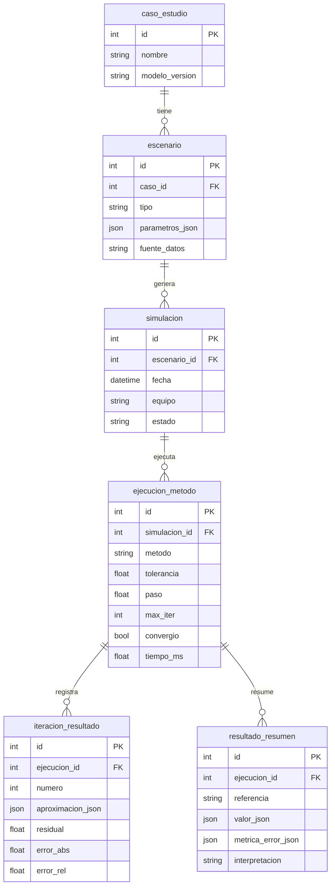

```mermaid
erDiagram
  caso_estudio ||--o{ escenario : tiene
  escenario ||--o{ simulacion : genera
  simulacion ||--o{ ejecucion_metodo : ejecuta
  ejecucion_metodo ||--o{ iteracion_resultado : registra
  ejecucion_metodo ||--o{ resultado_resumen : resume
  caso_estudio { int id PK  string nombre  string modelo_version }
  escenario { int id PK  int caso_id FK  string tipo  json parametros_json  string fuente_datos }
  simulacion { int id PK  int escenario_id FK  datetime fecha  string equipo  string estado }
  ejecucion_metodo { int id PK  int simulacion_id FK  string metodo  float tolerancia  float paso  int max_iter  bool convergio  float tiempo_ms }
  iteracion_resultado { int id PK  int ejecucion_id FK  int numero  json aproximacion_json  float residual  float error_abs  float error_rel }
  resultado_resumen { int id PK  int ejecucion_id FK  string referencia  json valor_json  json metrica_error_json  string interpretacion }
```
